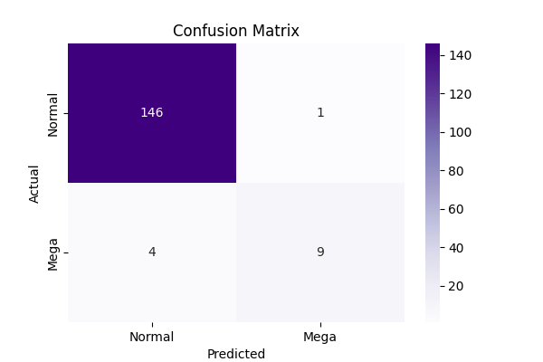
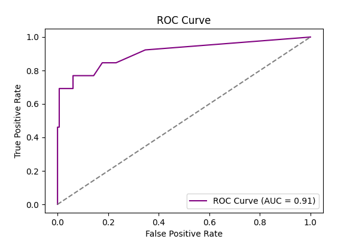
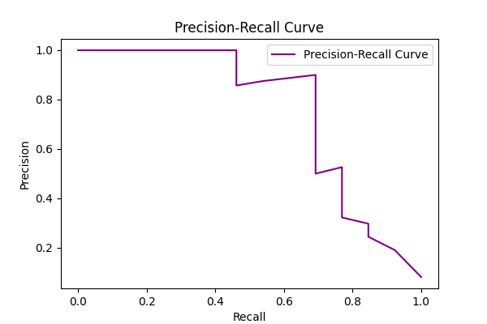

# Mini Machine Learning Experiment – Pokémon Mega Evolution Classification

## Overview
This project demonstrates the end-to-end application of **Machine Learning fundamentals** on a small dataset.  
It predicts whether a Pokémon has a **Mega Evolution** using a **Random Forest Classifier**.  
The workflow covers:
- Data preprocessing  
- Model training and evaluation  
- Visualization of results (Confusion Matrix, ROC, PR Curve)  
- Reflection on learning outcomes  

Libraries used: **Pandas**, **Seaborn**, **Matplotlib**, **Scikit-learn**

## Dataset

**Source:** Pokémon dataset (Kaggle / Custom)  
**File:** `data/Pokemon_raw_data.csv`

The dataset includes attributes like:
- `Name`, `Type 1`, `Type 2`, `Total`, `HP`, `Attack`, `Defense`, `Sp. Atk`, `Sp. Def`, `Speed`, `Generation`, `Legendary`

For model training, only numeric attributes were used:

A new binary target column `Mega_Evolution` was created:
- **1** → Pokémon has "Mega" in its name  
- **0** → Otherwise  

## Problem Statement

Predict whether a Pokémon has a **Mega Evolution** using classification, and visualize:
1. Confusion Matrix  
2. ROC Curve  
3. Precision–Recall Curve  

## How to Run

### Create a Virtual Environment
```bash
python -m venv venv
venv\Scripts\activate         
```

### Install Dependencies
```bash
pip install -r requirements.txt
```

### Run the Project
```bash
python main.py
```

When you run the script:
- The dataset will be loaded and preprocessed  
- The model will train and evaluate  
- Confusion Matrix, ROC, and Precision–Recall plots will be displayed  
- Predictions will be saved in `results/pokemon_mega_predictions.csv`  
- A reflection summary will be saved in `reflection.txt`


## Outputs & Visualizations

### Model Accuracy
The model achieved approximately **97% accuracy** on the test dataset.

### Confusion Matrix
> *(Placeholder for screenshot of the confusion matrix plot)*  
> 

### ROC Curve
> *(Placeholder for screenshot of the ROC curve plot)*  
> 

### Precision–Recall Curve
> *(Placeholder for screenshot of the PR curve plot)*  
> 


